<picture>
  <source media="(prefers-color-scheme: dark)" srcset="./assets/profile-dark.svg">
  <source media="(prefers-color-scheme: light)" srcset="./assets/profile-light.svg">
  
</picture>

<div align="center">

[](https://flightops-ai-mu.vercel.app/docs)
[](https://github.com/mitulpatel123/airline-data-reliability-lab)
[](https://www.linkedin.com/in/mitulpatel12/)
[](#)

</div>

## Engineering profile

I am an M.S. Information Technology student in Virginia, graduating in **April 2027**. I build cloud-ready backend, data, and applied AI systems where the engineering evidence is visible: typed contracts, failure handling, tests, observability, evaluation, and documented tradeoffs.

My 2027 focus is **software engineering, backend/platform, cloud, data engineering, and applied AI/ML**. Internship work authorization is coordinated through my university's CPT process and confirmed for each role before applying.

## Shipped systems

### FlightOps AI

[FlightOps AI](https://github.com/mitulpatel123/flightops-ai) is an airline-operations intelligence API for retry-safe flight-event ingestion, explainable operational risk, and evaluated T-24h arrival-delay prediction.

```text
official BTS data -> chronological evaluation -> portable model -> versioned API
```

| Proof | What is implemented |
|---|---|
| [Live API](https://flightops-ai-mu.vercel.app/docs) | Interactive OpenAPI documentation on Vercel |
| Reliability | Idempotent ingestion, validation, health checks, and metrics |
| Engineering | Eight automated tests, Docker, CI, architecture decisions, and scoped production deployment |
| Evaluated ML | 90,000 official BTS records; future-period test; ROC-AUC 0.640; PR-AUC 0.335; recall 0.748; Brier 0.176 |
| Model integrity | Leakage-resistant T-24h contract, calibration, carrier/airport/time error slices, model card, and inspectable JSON inference |

**Stack:** Python · FastAPI · Pydantic · SQL/SQLite · Docker · GitHub Actions · REST/OpenAPI · Vercel

### Airline Data Reliability Lab

[Airline Data Reliability Lab](https://github.com/mitulpatel123/airline-data-reliability-lab) is an observable, quality-gated airline batch pipeline that records what loaded, what failed, and why.

```text
CSV -> schema + business checks -> quality gate -> facts or quarantine -> API + metrics + report
```

| Proof | What is implemented |
|---|---|
| Data quality | Required-schema checks, reason-coded row quarantine, and fail-closed batch thresholds |
| Reliability | Deterministic fact keys make source retries idempotent; every run records its source SHA-256 |
| PostgreSQL path | SQLAlchemy schema, PostgreSQL 16 Compose environment, run/check/fact/quarantine tables |
| Verification | Seven tests, passing CI, FastAPI evidence endpoints, Prometheus metrics, and a generated report |

**Stack:** Python · FastAPI · PostgreSQL · SQLAlchemy · Docker Compose · GitHub Actions · Prometheus

## Current focus

1. Turn the two shipped systems into tailored resume bullets and role-specific application evidence.
2. Confirm CPT dates and limits with the university DSO before accepting or starting any internship.
3. Add AWS/Terraform depth only after the application pipeline is active and tracked.

## Technical direction

| Systems | Data + AI | Delivery |
|---|---|---|
| Python, FastAPI, REST, SQL | Data contracts, baselines, evaluation | Docker, CI/CD, cloud deployment |
| TypeScript, React | Retrieval, embeddings, model cards | Observability, failure handling, documentation |

## Working principles

- **Ship evidence, not keyword lists.** Every featured skill should point to code, tests, a live system, or measured results.
- **Design for failure.** Retries, duplicate events, invalid inputs, degraded dependencies, and rollback paths are part of the product.
- **Measure AI honestly.** Start with a baseline; report calibration, latency, errors, and limitations before claiming improvement.
- **Keep provenance clear.** External projects are learning references or attributed forks—not cosmetically modified work presented as original.

## Current signal

```yaml
status: internship_application_ready
shipped_projects: 2
flagship: flightops-ai-v0.2
current_priority: tailored applications + targeted outreach
target_roles:
  - software engineering
  - backend / platform engineering
  - cloud / data engineering
  - applied AI / ML engineering
```

<div align="center">

**Open to 2026-2027 U.S. internship conversations in cloud, backend, data, and applied AI.**

</div>
